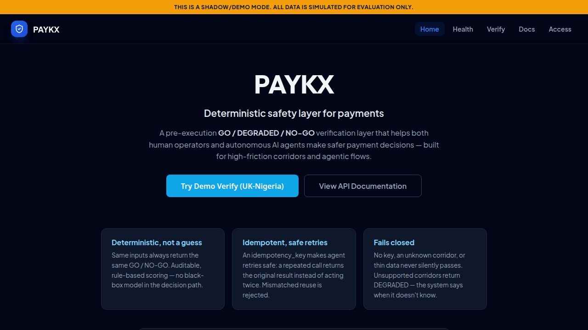
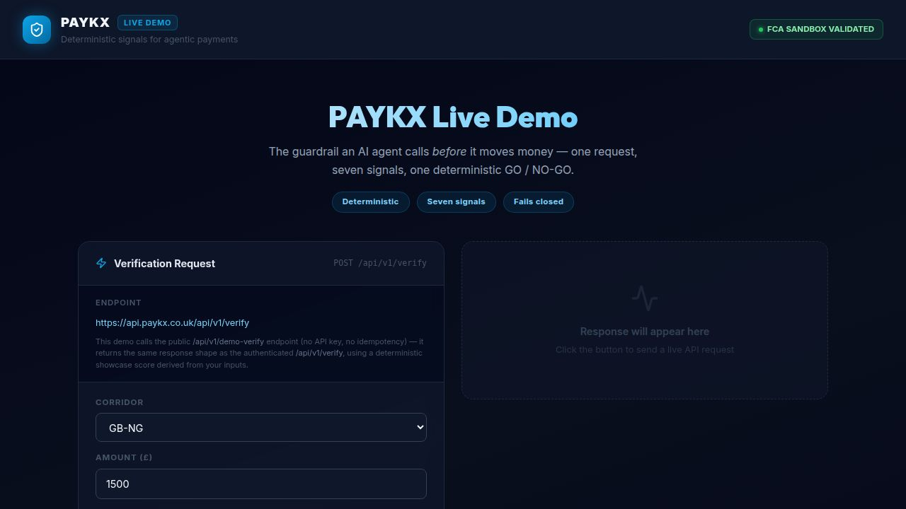

# PAYKX

  **Pre-execution verification and safety layer for high-friction and agentic payments.**

  PAYKX provides a deterministic decision layer that evaluates payments **before** money moves. It returns a clear `GO`, `DEGRADED`, or `NO-GO` signal along with explainable risk factors.

  This helps reduce failed transactions, trapped liquidity, and operational risk — whether the payment is initiated by a human or an autonomous AI agent.

  ## What is PAYKX?

  Most innovation in payments today focuses on **moving money faster**. However, as payments become more automated and AI agents start initiating transactions, the real challenge shifts to **deciding whether a payment should happen at all**.

  PAYKX introduces a **pre-transaction decision layer** that sits before money moves. It assesses risk and intent upfront and provides a clear signal on whether a payment is safe to execute, should be delayed, or requires further review.

  Rather than replacing existing payment rails or PSPs, PAYKX acts as an independent verification layer that adds clarity and control before execution.

  ## Why PAYKX?

  As payments become more automated, the biggest risk shifts from *how* money moves to *whether* it should move at all.

  Current systems are mostly reactive — they detect issues *after* a payment has already been sent. On complex corridors, this leads to failed transactions, manual reviews, compliance problems, and poor customer experiences.

  PAYKX introduces a **pre-transaction decision layer** that evaluates risk and intent **before** execution. This gives payment providers and platforms an independent signal to decide whether to proceed, delay, or block a transaction.

  By catching issues earlier, PAYKX helps reduce failed payments, trapped liquidity, and operational overhead — especially as more payments become agent-driven.

  ## Current Status

  - **Stage**: Pre-pilot (Demo / Shadow Mode)
  - **Focus**: High-friction corridors (e.g. UK–Nigeria) and emerging agentic payment flows
  - **Testing**: Validated using 750,000+ synthetic transactions in the FCA Digital Sandbox
  - **Live Demo**: [https://api.paykx.co.uk](https://api.paykx.co.uk)

  > **Note**: The system is currently running in **demo/shadow mode**. No real transactions are processed.

  ## Key Features

  - Real-time pre-transaction decisioning
  - Explainable scoring with multiple risk signals
  - Corridor health and compliance evaluation
  - Support for idempotent and secure API requests
  - Designed to work alongside existing payment infrastructure

  ## Live Demo

  Try the current version of PAYKX here:

  **[→ Live Demo](https://api.paykx.co.uk)**

  > The system is currently running in **demo/shadow mode**. All data is simulated for evaluation purposes.

  ## Screenshots

  ### Dashboard
  

  ### Demo Verification Page
  

  ### Verification Result
  

  ## Tech Stack

  - **Frontend**: React 18 + Vite + TypeScript + shadcn/ui
  - **Backend**: Express + TypeScript + Drizzle ORM
  - **Database**: PostgreSQL
  - **Other**: Zod, TanStack Query, Recharts

  ## Roadmap

  - Production deployment and real corridor integrations
  - Enhanced support for agentic and autonomous payment flows
  - Self-hosted deployment option
  - Expanded risk models and corridor coverage

  ## Contact

  - **Website**: [https://paykx.co.uk](https://paykx.co.uk)
  - **LinkedIn**: [Taseen Rayed](https://www.linkedin.com/in/taseen-r-5299b92a7)

  ---

  **Status**: Early stage • Actively building • Open to conversations with potential partners and co-founders.
  